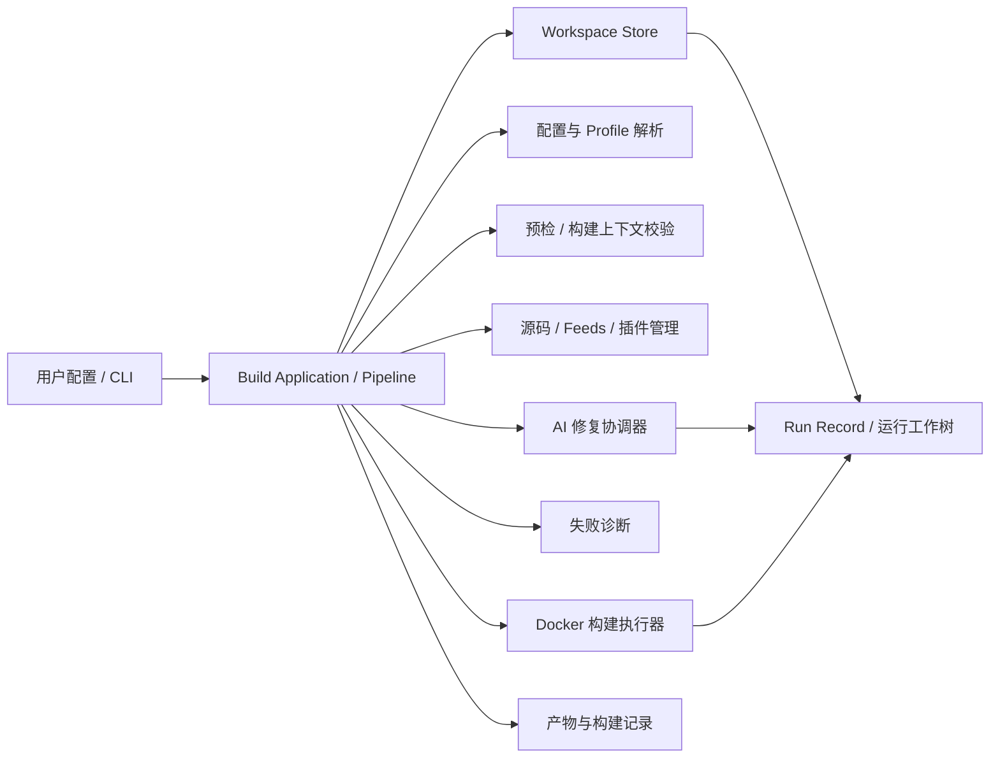

# Auto-OpenWrt 架构设计 v1

## 架构目标

Auto-OpenWrt 采用“单体 CLI + 工作区核心模型 + 运行工作树隔离 + 流水线编排 + Docker 构建边界 + 构建前健康检查”的系统架构。

CLI 是用户的统一入口；工作区承载配置、共享源码缓存、运行工作树、构建缓存、构建记录、失败现场、AI 修复检查点、adopted patches 和最终产物；流水线负责把一次固件构建拆成可检查、可诊断、可恢复、可重试的阶段。

架构按支持全部 OpenWrt target 设计。系统不使用 target 白名单，用户通过配置声明任意 OpenWrt target、subtarget、profile，构建上下文校验阶段由 OpenWrt 源码上下文完成有效性校验。

## 总体架构

## 模块职责

### CLI 入口层

提供初始化、构建、更新、健康检查、日志查看等用户操作。

CLI 负责把用户命令转换为工作区任务，不要求用户手动进入 OpenWrt 源码目录执行构建命令。

### 构建应用与流水线层

流水线是应用层编排者。它接收 CLI 请求，创建 run record，按阶段调用配置、健康检查、源码、插件、Docker 执行、失败诊断、AI 修复和产物记录模块。

流水线只通过结构化接口调用模块，不直接保存模块内部状态，不绕过 Workspace Store 写持久化文件。

### 配置与 Profile 管理层

负责读取用户配置，解析全局设置、多个 build profile、target、feeds、插件、构建选项和 AI 修复策略。

一个工作区可以维护多个 build profile。每个 profile 表示一套独立固件构建目标，并拥有独立的 run record、运行工作树、日志、adopted patches 和产物归档。

### 健康检查层

健康检查分为预检和构建上下文校验。

预检在源码更新前执行，检查宿主系统、Docker 可用性、CLI 运行权限、工作区权限、磁盘空间、网络能力和配置完整性。构建上下文校验在运行工作树准备后执行，检查 OpenWrt target 有效性、运行工作树存储、Docker 路径映射、插件风险和 AI CLI 对当前 run 工作树的访问能力。

关键检查失败时应阻断构建，并输出明确、可执行的修复建议。

### 工作区层

工作区是 Auto-OpenWrt 的核心状态边界。

`sources/` 只作为共享源码缓存；`worktrees/<profile>/<run-id>/` 是每次构建的唯一可变源码区。工作区负责组织 OpenWrt 源码缓存、feeds 源码缓存、插件源码缓存、构建缓存、运行工作树、构建日志、成功版本记录、失败诊断包、AI 修复检查点、adopted patches 和最终固件产物。

### 源码管理层

统一管理 OpenWrt 主源码、feeds 源码和自定义插件源码。

默认策略是跟随配置中的分支最新版本；只有成功构建后才更新 success lock，失败构建不得覆盖上一次成功状态。准备运行工作树时，源码管理层从共享缓存创建当前 run 工作树，并按同 profile 的 success lock 应用 adopted patches。

### 插件管理层

负责接入自定义 feeds 和插件，并记录插件来源、分支、路径、启用状态和风险类型。

插件按风险分层：

- 应用 / LuCI 类插件：例如 OpenClash。
- 内核模块 / 补丁型插件：例如 Turbo ACC 相关 fullcone、offload、kmod 能力。
- 未知风险插件：无法自动判断类型时进入保守提示。

风险分层用于构建提示、health report、run record、失败诊断和 AI 修复上下文生成，不用于限制用户选择。

### Docker 执行器层

Docker 是构建执行边界，用于隔离 OpenWrt 构建环境。

CLI 在宿主侧调度 Docker 构建。Docker 执行器只能挂载当前 run 工作树、缓存目录和产物目录，并把 Docker image、platform、storage driver、volume 名称或宿主映射路径写入 run record。`worktrees/<profile>/<run-id>/` 是当前 run 的逻辑工作树标识；物理源码位置由 worktree manifest 记录。macOS 或非大小写敏感文件系统上，构建工作树和缓存默认使用 Docker volume 或 Linux 原生文件系统。

### 失败诊断与 AI 修复层

构建失败后，系统收集失败阶段、失败包、关键日志、源码版本、resolved config、插件列表、插件风险类型、health report 和当前 run 工作树差异。

AI 修复前必须创建当前 run 工作树检查点。AI CLI 只允许修改当前 run 工作树；每轮修复的输入、输出、源码差异和重试结果都必须记录。最多执行 5 轮修复重试，超过后停止并保留现场。

AI 修复后的构建成功时，系统自动把最终差异归档为 profile 级 adopted patch，并把 adopted patch id 写入 success lock。失败或超过重试次数时不得采纳补丁，不得更新 success lock。

### 产物与记录层

成功构建后归档完整固件、构建日志、resolved config、health report、success lock、源码版本记录、Docker 环境摘要和 adopted patches。

失败构建后归档失败日志、诊断上下文、AI 修复历史、检查点索引和最后现场信息。

## CLI 能力边界

- `init`：创建工作区与示例配置。
- `doctor`：独立执行健康检查，输出系统环境、Docker、AI 工具、权限、磁盘、网络、工作区和运行工作树存储状态。
- `build`：创建 run record，解析指定 profile，执行预检，再进入完整构建流水线。
- `update`：更新 OpenWrt、feeds、插件共享源码缓存。
- `logs`：查看最近构建日志、失败诊断、AI 修复记录和 adopted patch 记录。

## 验收场景

- 配置可以声明任意 OpenWrt target、subtarget、profile，并进入统一构建流程。
- 一个工作区可以维护多个 build profile，且 run record、运行工作树、构建记录、产物、日志和 adopted patches 互不混淆。
- `doctor` 可以独立执行健康检查，并输出系统环境、Docker、权限、AI CLI、磁盘、网络、工作区和运行工作树存储状态。
- `build` 每次构建前自动执行预检，关键检查失败时阻断构建。
- AI 自动修复启用时，若 AI CLI 不存在、不可执行或无权限访问当前 run 工作树，构建上下文校验应明确失败。
- 自定义 feeds 和插件可以被接入构建，并在 run record 中记录来源版本和风险类型。
- OpenClash 被识别为应用 / LuCI 类插件；Turbo ACC 被识别为内核模块 / 补丁风险类插件。
- Docker 执行器不直接修改产品配置，且容器路径映射可以从 run record 回溯。
- 构建失败时能生成诊断上下文包，并触发 AI 修复流程。
- AI 修复最多重试 5 次，且每次修复前都有可回滚检查点。
- AI 修复成功后自动归档 adopted patch 并写入 success lock；失败后不采纳补丁、不更新 success lock。
- 成功构建后产物包含固件、日志、resolved config、health report、success lock、源码版本记录、Docker 环境摘要和 adopted patch 索引。

## 默认决策

- 用户使用纯配置 CLI；配置文件采用 YAML。
- Go CLI 是产品主入口；Docker 只作为构建执行环境。
- 架构支持全部 OpenWrt target；target 有效性由 OpenWrt 源码上下文校验。
- 单个项目工作区支持多个 build profile。
- 每次构建使用 `worktrees/<profile>/<run-id>/` 专属运行工作树。
- 每次构建前默认执行预检。
- 默认更新到分支最新源码；成功后写入 success lock，不成功不覆盖上次成功记录。
- AI CLI 由用户自行安装和授权；Auto-OpenWrt 负责编排上下文、调用、重试、记录和成功修复后的自动补丁采纳。
