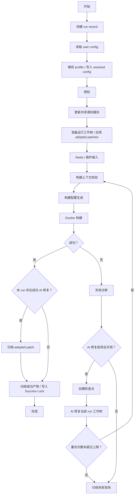

# 构建流水线

## 阶段定义

一次 `build` 由以下阶段组成。共享源码更新只在当前 run 开始时执行一次；AI 修复重试不得重新更新共享源码缓存。

1. 创建 run record。
2. 读取 user config。
3. 解析 build profile 并写入 resolved config。
4. 执行预检：宿主环境、Docker、权限、磁盘、网络、配置完整性和工作区目录。
5. 更新共享源码缓存：OpenWrt、feeds、插件源码。
6. 准备当前 run 工作树：从共享源码缓存创建 `worktrees/<profile>/<run-id>/`，并按 success lock 应用 adopted patches。
7. 接入 feeds 和插件，记录插件风险类型。
8. 执行构建上下文校验：OpenWrt target/subtarget/profile 有效性、工作树可写性、Docker 路径映射、AI CLI 对当前工作树的访问能力。
9. 生成 OpenWrt 构建配置。
10. 执行 Docker 构建。
11. 判定构建结果。
12. 构建失败时生成诊断上下文。
13. AI 修复启用且可用时创建检查点、调用 AI CLI、记录差异，然后从第 8 阶段重试。
14. 构建成功且本 run 有成功 AI 修复时，归档最终 diff 为 adopted patch。
15. 归档成功产物并写入 Success Lock，或归档失败现场。

## 状态流转

## 阶段记录

每个阶段必须记录：

- 阶段名称。
- 开始时间。
- 结束时间。
- 状态：`pending`、`running`、`succeeded`、`failed`、`skipped`。
- 关键日志路径。
- 失败原因。
- 下一步建议。

运行工作树准备阶段必须额外记录 worktree manifest。Docker 构建阶段必须额外记录 Docker image、platform、volume 名称和路径映射。AI 修复阶段必须额外记录修复轮次、checkpoint id、AI CLI 退出码、stdout/stderr 路径和 diff 路径。

## 阻断规则

- 配置无法读取或解析时，不进入预检。
- 预检关键项失败时，不进入源码更新。
- 共享源码缓存更新失败时，不进入运行工作树准备。
- 当前 run 工作树不可写或不满足构建存储要求时，不进入构建配置生成。
- target、subtarget、profile 在 OpenWrt 源码上下文中无效时，不进入 Docker 构建。
- Docker 不可用时，不进入 Docker 构建。
- AI 自动修复启用但 AI CLI 不可用、不可执行或无权限访问当前 run 工作树时，构建上下文校验失败，不进入 Docker 构建。

## 重试和采纳规则

- AI 修复前必须创建当前 run 工作树检查点。
- 每轮修复后从构建上下文校验阶段重新进入流水线。
- 最多执行 `ai_repair.max_retries` 轮 AI 修复重试，默认值为 5。
- 修复后构建成功时，归档最终 diff 为 profile 级 adopted patch。
- 成功构建后写入 Success Lock，并记录 adopted patch ids。
- 失败构建不得覆盖上一次 Success Lock，不得生成 adopted patch。
